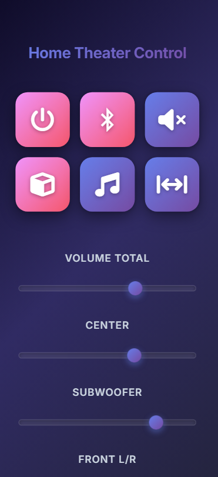

# 🎬 Home Theater Control System v2.5

Home theater control system based on ESP8266 (NodeMCU) with PT2322, web interface control, voice commands (Alexa), IR control, and OTA updates.



---

## ✨ Features

### 🌐 Web Control
- Modern and responsive web interface (mobile + desktop)
- Total and individual volume control (center, subwoofer, front, rear)
- System toggle, Bluetooth, mute, and 3D/DDD
- Status page with detailed system information
- mDNS enabled (`http://hometheater.local` and `http://home.local`)

### 🎙️ Voice Control (Alexa)
- SinricPro integration
- Turn system on/off
- Adjust volume
- Mute/unmute

### 📡 Other Features
- **OTA Updates**: Firmware updates over WiFi (no USB cable!)
- **IR Control**: Infrared command reception
- **WiFi Manager**: WiFi configuration via AP portal if connection fails
- **Non-blocking delays**: Always responsive system
- **HTML in PROGMEM**: Saves ~3.5KB of RAM

---

## 🔧 Required Hardware

| Component | Description |
|-----------|-------------|
| **NodeMCU** | ESP8266 (tested with 4MB Flash) |
| **PT2322** | 5.1 audio controller via I²C |
| **IR Receiver** | Infrared receiver (e.g., TSOP4838) |
| **BC547** | NPN transistor for relay control |
| **ATX Power Supply** | System power (standby for NodeMCU) |
| **HD Audio Rush** | 5.1 audio decoder (optional) |
| **Bluetooth Module** | VHM-314 or similar (optional) |
| **Relay** | For Bluetooth control |

---

## 📌 Pin Configuration

```cpp
D1 (GPIO5)  → I²C SCL (PT2322)
D2 (GPIO4)  → I²C SDA (PT2322)
D3 (GPIO0)  → General control relay
D4 (GPIO2)  → IR receiver
D5 (GPIO14) → Audio Input Control (BC547 → HD Audio Rush)
D6 (GPIO12) → Bluetooth Control (Relay)
D7 (GPIO13) → 5.1/2.1 control
D8 (GPIO15) → PSON (ATX power supply on/off via BC547)
```

---

## 🚀 Installation and Setup

### 1. Software Requirements
- [Arduino IDE](https://www.arduino.cc/en/software) 1.8.x or higher
- **ESP8266 Boards**:
  - Open Arduino IDE → Preferences
  - In "Additional Board Manager URLs" add:
    ```
    http://arduino.esp8266.com/stable/package_esp8266com_index.json
    ```
  - Go to Tools → Board → Boards Manager
  - Install "esp8266 by ESP8266 Community" (version 3.x.x)

### 2. Required Libraries
Install via Arduino IDE (Tools → Manage Libraries):

```
✅ ESP8266WiFi (included in ESP8266 package)
✅ ESP8266WebServer (included in ESP8266 package)
✅ ESP8266mDNS (included in ESP8266 package)
✅ ArduinoOTA (included in ESP8266 package)
✅ PT2322 → https://github.com/Tiogaplanet/PT2322
✅ IRremoteESP8266 → Install via Library Manager
✅ SinricPro → Install via Library Manager
✅ WiFiManager → Install via Library Manager
```

### 3. Credentials Setup

**IMPORTANT**: Your credentials are kept in a separate file for security!

1. **Navigate to** `HomeTheater_v2/`
2. **Copy** `config.example.h` to `config.h`:
   ```bash
   copy config.example.h config.h
   ```
3. **Edit** `config.h` with your credentials:

```cpp
// ⚠️ YOUR SINRIC PRO CREDENTIALS
#define SPEAKER_DEVICE_ID       "your_speaker_id_here"
#define SWITCH_DEVICE_ID        "your_switch_id_here"
#define APP_KEY                 "your_app_key_here"
#define APP_SECRET              "your_app_secret_here"

// WiFi AP (when connection fails)
#define WIFI_AP_PASSWORD        "YourStrongPassword@2025"

// OTA (remote updates)
#define OTA_PASSWORD            "HomeTheater@2025"
```

4. **Get SinricPro credentials**:
   - Go to [https://sinric.pro/](https://sinric.pro/)
   - Create a free account
   - Add devices: 1x Speaker + 1x Switch
   - Copy IDs and keys

### 4. Firmware Upload

**First time (via USB):**
1. Connect NodeMCU via USB cable
2. Select: Tools → Board → NodeMCU 1.0 (ESP-12E Module)
3. Select: Tools → Port → (your COM port)
4. Configure: Tools → Flash Size → 4MB (FS:2MB OTA:~1019KB)
5. Click Upload (→)

**Subsequent updates (via OTA):**
1. Open Arduino IDE
2. Tools → Port → `HomeTheater at 192.168.x.x`
3. Click Upload (→)
4. Enter OTA password when prompted

---

## 🌐 System Access

### Access URLs

After first boot, access:

```
http://hometheater.local          ← Main page
http://home.local                 ← Alternative alias
http://192.168.x.x                ← Direct IP (always works)
```

### Status Page

```
http://hometheater.local/status-page    ← Visual interface
http://hometheater.local/status         ← JSON API
```

Status page shows:
- 🖥️ System information (version, uptime, chip ID)
- ⚡ CPU and Flash (frequency, size, speed)
- 💾 RAM Memory (free, fragmentation)
- 📡 WiFi (SSID, channel, IP, MAC, signal)
- 🔊 Home Theater state (volumes, mute, etc)

### If `.local` doesn't work:

**Windows:**
- Install [Bonjour Print Services](https://support.apple.com/kb/DL999)
- Or edit `C:\Windows\System32\drivers\etc\hosts`:
  ```
  192.168.x.x    hometheater.local
  192.168.x.x    home.local
  ```

**Linux/Mac:**
- Native mDNS support!

---

## 🎮 System Usage

### Web Interface

The interface has 6 main buttons:

| Button | Function |
|--------|----------|
| 🔌 **Power** | Turn system on/off |
| 📶 **Bluetooth** | Enable/disable Bluetooth module |
| 🔇 **Mute** | Mute/unmute audio |
| 🎲 **3D** | Enable/disable 3D/DDD effect |
| 🎵 **Audio In** | Switch audio input |
| 🔊 **5.1/2.1** | Toggle channel mode |

**Volume Controls:**
- Total Volume (0-79)
- Center (0-15)
- Subwoofer (0-15)
- Front L/R (0-15)
- Surround L/R (0-15)

### Voice Commands (Alexa)

```
"Alexa, turn on home theater"
"Alexa, turn off home theater"
"Alexa, increase home theater volume"
"Alexa, decrease home theater volume"
"Alexa, set home theater volume to 50"
"Alexa, mute home theater"
```

### IR Control

Configure your IR remote and add codes in the code:

```cpp
void processIRCommand(decode_results *results) {
    switch(results->value) {
        case 0xYOUR_CODE_HERE:  // Power
            // Your code
            break;
        // ... more commands
    }
}
```

---

## 🔒 Security

### ⚠️ IMPORTANT: Protect Your Credentials!

The `config.h` file contains sensitive information and should **NEVER** be shared or committed to Git.

**What's protected:**
- ✅ `config.h` is in `.gitignore`
- ✅ Only `config.example.h` goes to GitHub
- ✅ Passwords and keys stay on your device

**Never share:**
- SinricPro IDs and keys
- WiFi AP and OTA passwords
- `config.h` file

**If credentials are accidentally exposed:**
1. Change ALL passwords IMMEDIATELY
2. Regenerate keys in SinricPro
3. Remove file from Git history

---

## 🐛 Troubleshooting

### NodeMCU doesn't connect to WiFi
1. WiFi Manager creates an AP: "Home Theater"
2. Connect to it with password: `@2025` (or your config password)
3. Configure WiFi through web portal

### OTA doesn't work
- First update **MUST be via USB**
- Verify you're on the same WiFi network
- Confirm OTA password in `config.h`

### `.local` doesn't resolve
- Install Bonjour (Windows)
- Use direct IP: `http://192.168.x.x`
- Edit hosts file

### System reboots randomly
- Insufficient power supply (use quality PSU)
- Check connections (especially I²C)
- Monitor RAM on `/status` page

### Debug Logs

Connect via Serial Monitor (115200 baud) to see detailed logs:
```
[0s] [INFO] 🌟 Starting system...
[3s] [INFO] ✅ WiFi connected!
[4s] [INFO] ✅ OTA enabled!
[6s] [INFO] ✅ [SinricPro] Connected
```

---

## 📊 Technical Specifications

### Performance
- **Free RAM**: ~30-40KB (of 80KB total)
- **Flash Used**: ~550KB (of 4MB total)
- **CPU**: 160 MHz
- **Web Latency**: < 100ms (local network)

### Limitations
- Supports only 2.4GHz WiFi
- Up to 4 simultaneous HTTP clients
- SinricPro: limit of ~60 commands/minute (free tier)

---

## 🛠️ Development

### Project Structure

```
HomeTheater_v2/
├── HomeTheater_v2.ino     ← Main code
├── config.h               ← Your credentials (DON'T commit!)
├── config.example.h       ← Configuration template
├── webpages.h             ← HTML/CSS in PROGMEM
└── .gitignore             ← Sensitive file protection

exampleofthepage.html      ← Web interface preview
status-page.html           ← Status page preview
test-tone.html             ← Channel test page preview
```

### Compilation

Recommended settings in Arduino IDE:

```
Board:              NodeMCU 1.0 (ESP-12E Module)
Flash Size:         4MB (FS:2MB OTA:~1019KB)
CPU Frequency:      160 MHz
Upload Speed:       115200
Erase Flash:        Only Sketch (first time: All Flash Contents)
```

## 📝 Changelog

### v2.5 (12/13/2025)
- ✨ Responsive web interface (mobile + desktop)
- ✨ OTA Updates over network
- ✨ Complete status page with system information
- ✨ Separate configuration file (`config.h`)
- ✨ HTML moved to PROGMEM (~3.5KB RAM savings)
- ✨ Non-blocking delays
- ✨ mDNS with multiple aliases
- 🐛 Stability fixes
- 🔒 Security improvements

### v1.0 (Original)
- Basic web control
- SinricPro integration
- IR control
- PT2322 for 5.1 audio

---

## 📄 License

This project is licensed under the [MIT License](LICENSE).

You are free to use, modify, and distribute this project, as long as you maintain the original credits.

---

## 👤 Author

**OnlyCampe**
- GitHub: [@onlycampe](https://github.com/onlycampe)

---

## 🙏 Acknowledgments

- ESP8266 Community
- PT2322 Library
- IRremoteESP8266
- SinricPro
- WiFiManager

---

**⭐ If this project was useful, leave a star on GitHub!**

---

**Developed with ❤️ for Home Theater and IoT enthusiasts**
