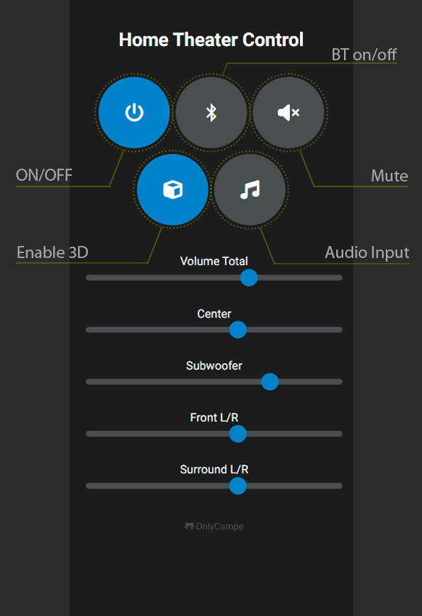

# Home Theater Control System

## Overview

This project is a home theater control system based on the ESP8266 microcontroller. It allows you to control various aspects of your home theater, including power, volume, and audio settings, through both a web interface and voice commands via SinricPro.




## Features

- **Wi-Fi Connectivity:** Connects to your home Wi-Fi network.
- **Web Interface:** Control the system through a web page served by the ESP8266.
- **IR Control:** Accepts commands from an infrared remote.
- **Voice Control:** Integrates with SinricPro to allow voice commands.
- **Audio Control:** Adjust total volume, center, subwoofer, front, and rear speaker volumes.
- **Bluetooth and Audio Input Control:** Toggle Bluetooth and select audio inputs.
- **Standby Power and Switch Control:** NodeMCU and PT2322 are powered by the standby power of the ATX power supply. The ATX power supply is turned on by controlling the PSON pin with a BC547 transistor.
- **Bluetooth Module Control:** The Bluetooth module is turned on and off using a relay.
- **Audio Input Control:** The audio from the Bluetooth module is connected to the audio input of the HD Audio Rush decoder. An additional BC547 transistor is used to simulate button presses on the HD Audio Rush to control audio inputs.


## Hardware Requirements

- NodeMCU (ESP8266)
- PT2322 Audio Controller
- IR Receiver
- BC547 Transistor
- ATX Power Supply
- HD Audio Rush Decoder (for audio input control)
- Bluetooth Module (VHM-314) (optional)
- Relay (for Bluetooth module control)

## Software Requirements

- Arduino IDE
- ESP8266 Board Package
- Libraries:
  - `ESP8266WiFi`
  - `ESP8266WebServer`
  - `PT2322`
  - `ESP8266mDNS`
  - `IRremoteESP8266`
  - `SinricPro`
  - `SinricProSpeaker`

## Pin Configuration

- **IR Receiver:** `D4`
- **Power On/Off (PSON_PIN):** `D8`
- **Bluetooth Control:** `D6` (controlled by relay)
- **Audio Input Control:** `D5` (controls a BC547 transistor for HD Audio Rush input switching)
- **I2C SDA:** `D2`
- **I2C SCL:** `D1`

## Setup

1. **Install the required libraries** in the Arduino IDE.
2. **Configure Wi-Fi credentials** in the code:
   ```cpp
   const char* ssid = "network name";
   const char* password = "password";
   ```
3. **Configure SinricPro credentials**:
   ```cpp
   #define SPEAKER_ID        ""    // Device ID from SinricPro
   #define APP_KEY           ""    // Application key from SinricPro
   #define APP_SECRET        ""    // Application secret from SinricPro
   ```
4. **Upload the code** to your NodeMCU (ESP8266).

## Usage

### Web Interface

Access the web interface by navigating to the IP address of the ESP8266 on your network. The web page provides buttons to toggle the system, Bluetooth, and audio input, as well as sliders to adjust various volume settings.

### Voice Control

Use voice commands with SinricPro to control the power and volume. Example commands include:
- "Alexa, turn on the home theater."
- "Alexa, set the home theater volume to 50."

## Code Explanation

### Wi-Fi and Web Server Setup

The code connects the ESP8266 to the Wi-Fi network and sets up a web server to handle HTTP requests.

### IR Remote Handling

The `IRrecv` class is used to decode IR signals received by the IR receiver connected to pin `D4`.

### SinricPro Integration

The code integrates with SinricPro to handle voice commands for power and volume control. Callbacks are defined to handle these commands and update the system state accordingly.

### HTML and JavaScript for Web Interface

The web interface is built using HTML and styled with CSS. JavaScript functions handle the communication between the web page and the ESP8266 server to update settings in real-time.

### Audio Control with PT2322

The `PT2322` class is used to control audio settings such as volume, ~~bass~~, ~~middle~~, ~~and~~ ~~treble~~. The `applySettings` function applies these settings to the PT2322.

## License

This project is licensed under the MIT License. See the [LICENSE](LICENSE) file for details.

---

Feel free to contribute to this project by opening issues or submitting pull requests on GitHub. Happy building!
